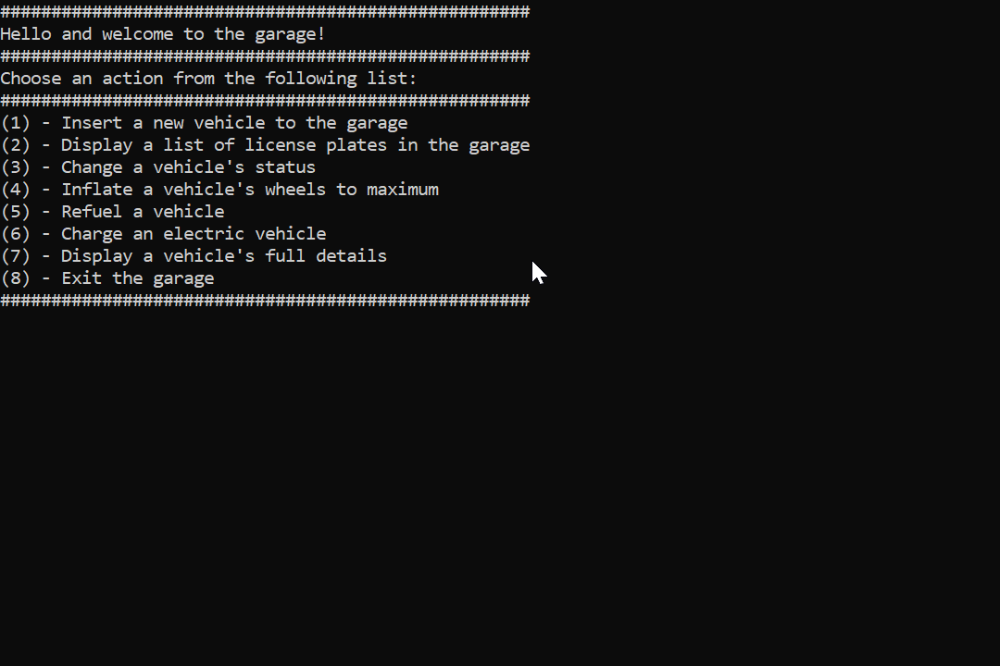

# Garage Manager 🚗🔧

**Garage Manager** is a console-based C# application designed to manage vehicles in a garage. This project demonstrates object-oriented programming (OOP) principles, focusing on polymorphism, inheritance, and clean code structure. It provides users with a set of actions to efficiently handle vehicle management tasks.

## Preview



## Overview

The **Garage Manager** system is built to handle various types of vehicles and provides a range of actions for users to manage their garage. It follows a modular structure to ensure separation of concerns between the core game logic and the console-based user interface.

## Features

- **Polymorphism and Inheritance:** The project is designed using OOP principles to allow flexibility and code reusability, utilizing polymorphism and inheritance to manage different vehicle types.
- **Error Handling with Custom Exceptions:** The system includes error handling using custom exceptions, ensuring robustness and easier debugging when unexpected values are provided.
- **Comprehensive Garage Management:** The system provides a variety of actions for managing vehicles, including adding, displaying, and maintaining vehicles in the garage.
- **Console-Based UI:** The user interface is built to run in the console, making it easy to interact with the system.

## User Actions

1. Insert a new vehicle into the garage.
2. Display a list of license plates in the garage.
3. Change a vehicle's status.
4. Inflate a vehicle's wheels to the maximum.
5. Refuel a fuel-powered vehicle.
6. Charge an electric vehicle.
7. Display the full details of a vehicle.
8. Exit the garage.

## Technologies Used

- **C#**
- **.NET Core**

## Getting Started

To run the project locally, follow these steps:

1. Clone the repository:

   ```bash
   git clone https://github.com/benhemoshai/Garage-Manager.git
   ```
2. Navigate to the project directory:

   ```bash
   cd Garage-Manager
   ```
3. **Right-click** on the `Ex03.ConsoleUI` project and select **"Set as Startup Project"** to ensure the console UI runs correctly.

4. Build and run the solution using your preferred C# IDE (e.g., Visual Studio or Visual Studio Code).


## Project Structure

```bash
GarageManager/
│
├── Ex03.ConsoleUI/            # Console-based UI
│   ├── App.config
│   ├── ConsoleDisplay.cs
│   ├── EnumValidator.cs
│   ├── Ex03.ConsoleUI.csproj
│   ├── GarageStarter.cs
│   ├── InputValidator.cs
│   └── Program.cs
│
├── Ex03.GarageLogic/          # Core garage management logic
│   ├── App.config
│   ├── Car.cs
│   ├── ElectricEngine.cs
│   ├── Engine.cs
│   ├── Enums.cs
│   ├── Ex03.GarageLogic.csproj
│   ├── GarageManager.cs
│   ├── GasEngine.cs
│   ├── Motorcycle.cs
│   ├── Truck.cs
│   ├── ValueOutOfRangeExceptions.cs
│   ├── Vehicle.cs
│   └── Wheel.cs
│
└── GarageManager.sln                    # Solution file
```

## Focus on OOP and Error Handling
The **Garage Manager** system leverages:

- **Polymorphism** to handle different vehicle types with a single interface.
- **Inheritance** to allow code reuse across different vehicle classes.
- **Encapsulation** to maintain clean and maintainable code architecture.
- **Custom Exception Handling** to validate input, ensuring safe interactions and detailed error messages.
